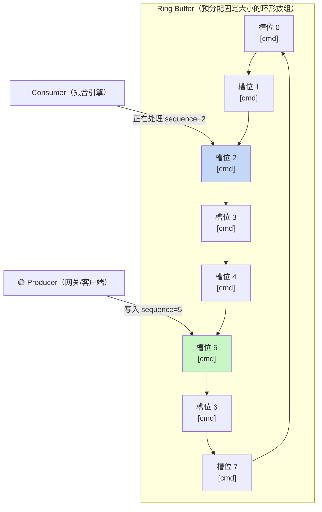
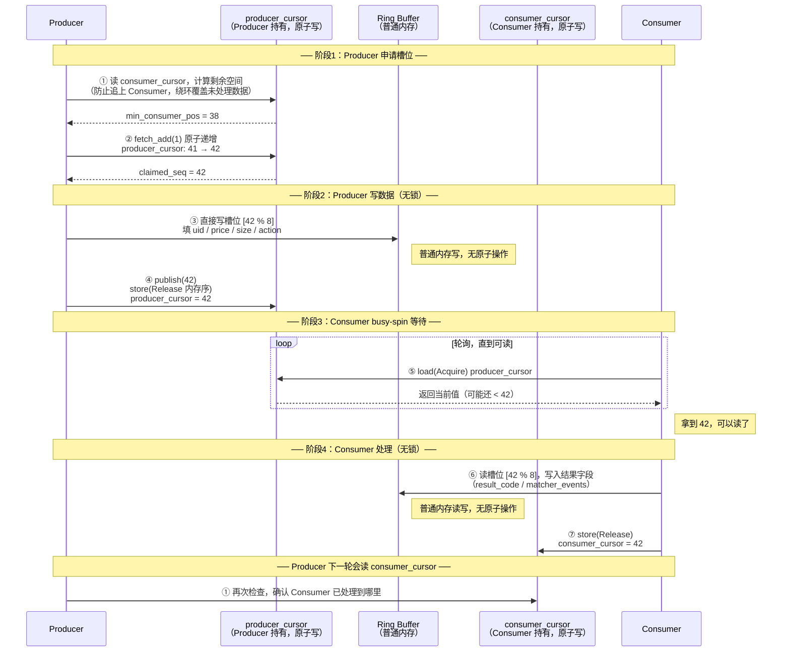
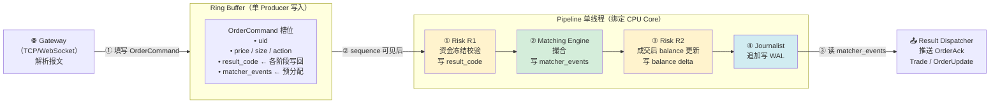
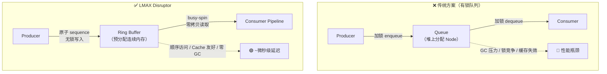

# LMAX Disruptor —— 撮合引擎并发架构指南

## 一、LMAX 是什么

LMAX Exchange 是英国一家外汇/CFD 交易所，2011 年发表论文并开源了其核心并发框架 **Disruptor**。核心主张：

> 传统并发编程的性能瓶颈不是 CPU 算力，而是**线程间协调的开销**——锁、CAS 竞争、内存屏障、上下文切换、GC 停顿。

Disruptor 的解法：**把协调开销降到接近零**。

---

## 二、核心概念

### 2.1 Ring Buffer（环形缓冲区）

```
预分配固定大小的环形数组（2 的幂次，便于取模用位运算）

index:  0    1    2    3    4    5    6    7
       [cmd][cmd][cmd][cmd][cmd][cmd][cmd][cmd]
                  ↑                  ↑
               consumer           producer
               cursor             cursor
```

- 启动时**一次性分配全部槽位**，运行时不分配/不回收
- 槽位对象由闭包初始化：`|| OrderCommand::default()`
- Producer 写入时直接覆盖旧槽位（环形复用）
- 没有 queue 的 node 分配，没有 GC 压力

### 2.2 Producer → Consumer 协议

```
Producer 写入：
  1. 申请 sequence（原子递增）
  2. 获得对应槽位的 &mut 引用
  3. 填写字段
  4. publish(sequence)  ← 内存屏障，对 consumer 可见

Consumer 读取：
  1. 等待 sequence 可用（busy-spin / yield / sleep）
  2. 处理 event（可以修改槽位，写入结果）
  3. 更新自己的 cursor
```

关键点：**同一个槽位被 producer 写入后，再被 consumer 读写，全程无锁**。只有 sequence 的原子操作是真正的共享状态。

### 2.3 Pipeline 多阶段处理

```
同一个 event 槽依次流过各阶段，每阶段读写同一块内存：

[Producer]
    ↓ sequence=42
[Risk R1]        读 uid/size，写 result_code
    ↓
[Matching Engine] 读 price/action，写 matcher_events
    ↓
[Risk R2]        读 matcher_events，写 balance delta
    ↓
[Journalist]     读整个 cmd，追加到 WAL
    ↓
[Result Consumer] 读 matcher_events，推送给客户端
```

每个阶段看到的是同一块内存，零拷贝，零分配。

### 2.4 Mechanical Sympathy（机械同理心）

硬件对性能的影响比算法复杂度更关键：

| 问题 | Disruptor 的应对 |
|------|-----------------|
| False sharing（CPU cache line 64字节，多核写同一 cache line 互相失效） | 对 sequence/cursor 做 cache line padding |
| Cache miss（随机内存访问） | Ring buffer 连续内存，顺序访问，prefetch 友好 |
| 分支预测失败 | 热路径避免条件分支 |
| 上下文切换 | Busy-spin 等待，pinned thread（CPU affinity） |

---

## 三、在 me-rs 中的落地思路

### 3.1 推荐架构

```
外部 TCP/WS
     ↓
[Gateway] 解析报文 → 填写 OrderCommand
     ↓  (single producer, ring buffer)
[Pipeline thread]  ← 单线程，绑定 CPU core
  ├─ Risk R1（资金冻结校验）
  ├─ DirectOrderBook（撮合）
  ├─ Risk R2（成交后 balance 更新）
  └─ Journalist（WAL 写入）
     ↓
[Result Dispatcher]  → 推送 OrderAck / Trade / OrderUpdate
```

Pipeline thread 是**严格单线程**，持有所有撮合状态，无需任何锁。

### 3.2 OrderCommand 作为 Event 载体

```rust
// 正确做法：结果写回 cmd，不返回新对象
pub fn place_gtc(&mut self, cmd: &mut OrderCommand) {
    if self.order_id_index.contains_key(&cmd.order_id) {
        cmd.result_code = CmdResultCode::DuplicateOrderId;
        cmd.matcher_events.push(MatcherEvent::new_reject(cmd.size, cmd.price));
        return;
    }

    let filled = self.try_match(cmd);          // 撮合结果写入 cmd.matcher_events
    if filled < cmd.size {
        self.rest_on_book(cmd, filled);        // 挂单
    }
    cmd.result_code = CmdResultCode::Success;
}
```

**不要**这样做：
```rust
// 错误：分配新对象，破坏零拷贝
fn place_gtc(&mut self, cmd: &OrderCommand) -> Vec<MatcherEvent> {
    let mut events = Vec::new();   // 堆分配，每次都触发
    ...
    events
}
```

### 3.3 预分配消除热路径分配

```rust
// Ring buffer 槽位初始化：预分配 matcher_events 容量
|| OrderCommand {
    matcher_events: Vec::with_capacity(8),  // 预留，复用不重分配
    ..Default::default()
}

// 槽位复用时清空而非重建
fn reset_command(cmd: &mut OrderCommand) {
    cmd.matcher_events.clear();   // 保留堆内存，只重置长度
    cmd.result_code = CmdResultCode::default();
}
```

### 3.4 订单内存池

```rust
// 用 Slab 作为订单池，避免 Box<Order> 的堆分配
orders: Slab<DirectOrder>   // 连续内存，index 即指针

// 分配：O(1)，无系统调用
let idx = self.orders.insert(DirectOrder { ... });

// 释放：O(1)，内存回到池中
self.orders.remove(idx);
```

### 3.5 Cache Line Padding（Rust 实现）

```rust
// sequence cursor 需要 padding，防止 false sharing
#[repr(C)]
struct PaddedSequence {
    value: AtomicU64,
    _pad: [u8; 56],   // 64 - 8 = 56，补齐一个 cache line
}
```

---

## 四、LMAX 是否是最优解？

### 适合 me-rs 的理由

| 场景 | 匹配度 |
|------|--------|
| 单 symbol 单线程撮合 | ✅ 完全匹配，无竞争 |
| 确定性回放（相同输入→相同输出） | ✅ 单线程天然确定性 |
| 极低延迟（< 10μs） | ✅ Disruptor 的核心优势 |
| 审计/可追溯（WAL） | ✅ Journalist 阶段自然集成 |

### 局限与替代方案

| 局限 | 替代思路 |
|------|---------|
| 多 symbol 扩容复杂（每个 symbol 一个线程+ring buffer） | **Actor 模型**（tokio actor per symbol）更易扩展，延迟略高 |
| Ring buffer 容量固定，burst 超容量会阻塞 producer | 调大 buffer size，或背压到 gateway |
| Rust 生态无官方 Disruptor 实现，自研成本高 | 用 crossbeam channel + 单线程 pipeline 近似替代 |
| Busy-spin 浪费 CPU（低流量时） | 低流量期可切换为 yield/sleep 等待策略 |

### 结论

对于**单 symbol 撮合引擎**，LMAX 风格是目前已知的最优实践之一。真正的竞争方案只有 Actor 模型（牺牲一点延迟换来更好的扩展性）。

me-rs 当前阶段（Phase 1，单线程 per symbol）：**LMAX 风格是正确选择**，不需要引入第三方 Disruptor crate，只需遵守以下约束即可获得大部分收益：

1. Pipeline 单线程，持有全部状态
2. `OrderCommand` 作为 event 载体（结果写回，不 return 新对象）
3. `Slab` 作为订单内存池
4. `matcher_events` 预分配 + `clear()` 复用
5. WAL 追加写，不在热路径 fsync

完整 Disruptor（ring buffer + sequence + busy-spin）在需要跨线程传递 command 时才必要。

---

## 五、流程图总览

### 5.1 Ring Buffer 结构



环形数组启动时**一次性分配**，运行时永不分配/释放，Producer 到达数组末尾后回绕覆盖旧槽位。

---

### 5.2 Producer → Consumer 无锁协议



共享状态只有 Sequence 这一个原子整数，槽位本身的读写**完全无锁**。

---

### 5.3 Pipeline 多阶段流水线（me-rs 落地架构）



同一块 `OrderCommand` 内存依次流过各处理阶段，**零拷贝、零分配**。

---

### 5.4 与传统消息队列的对比


