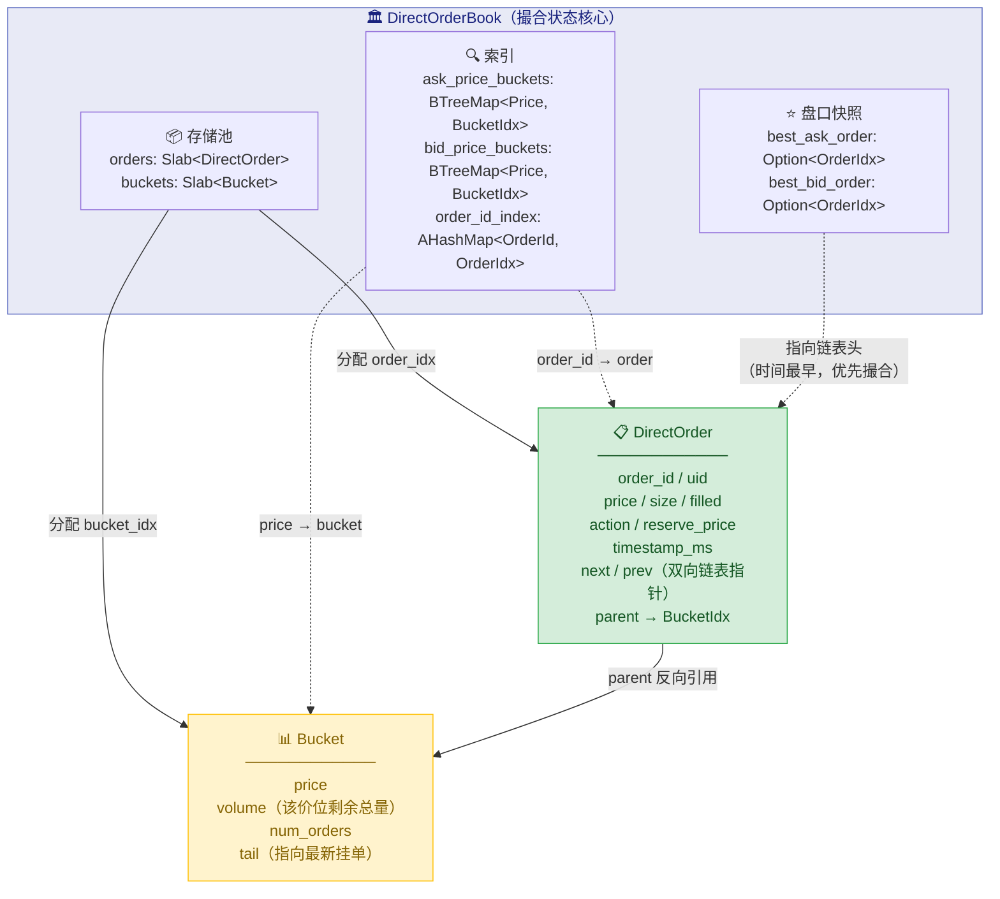
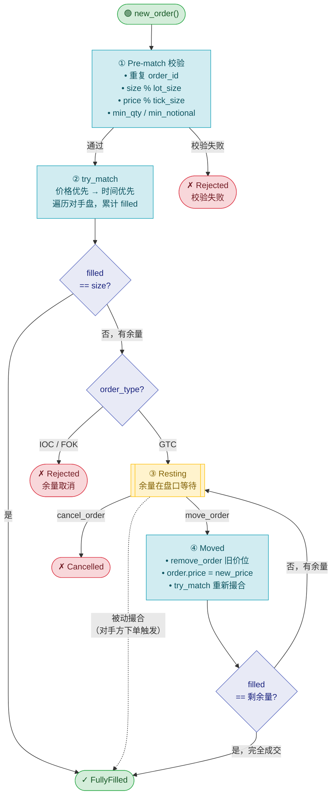
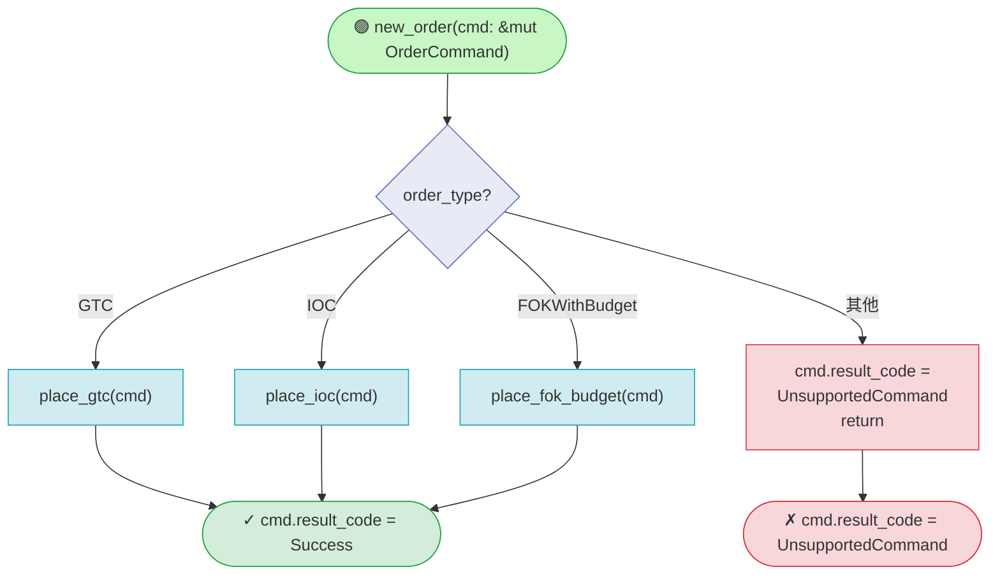
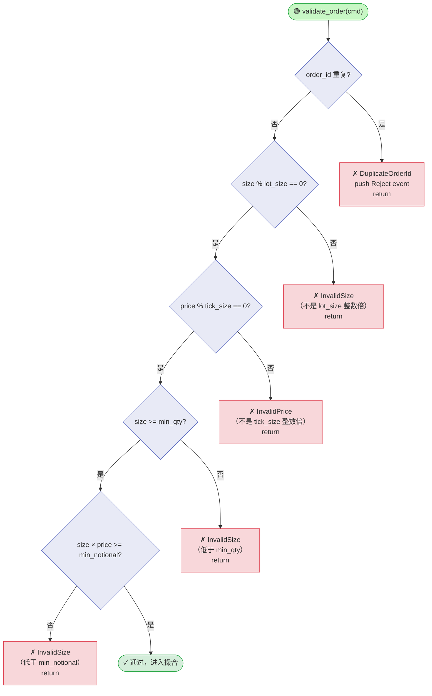
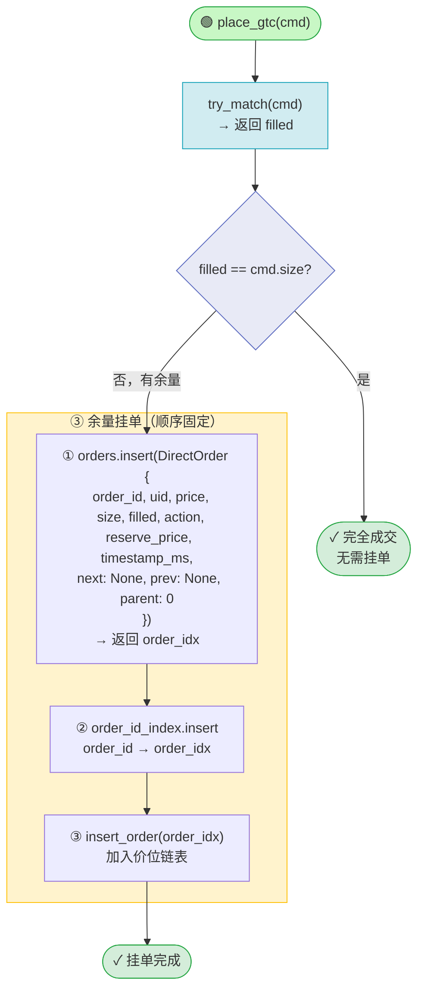
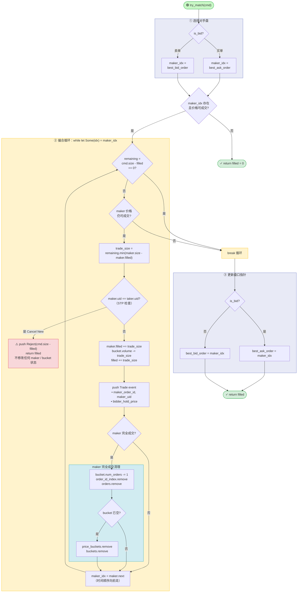
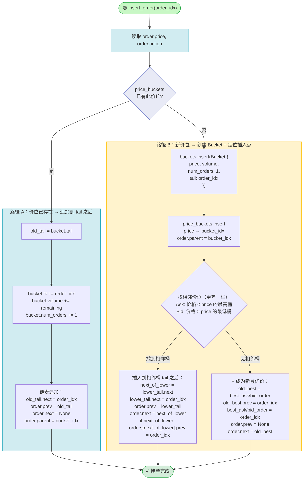
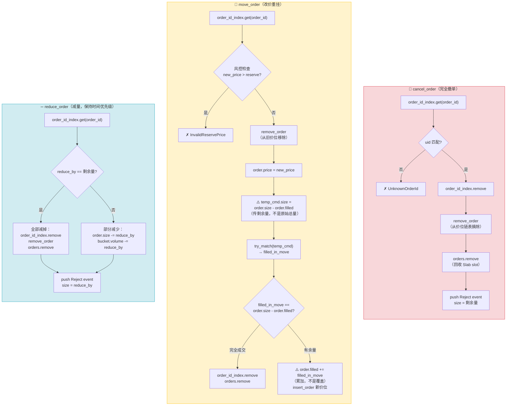

# DirectOrderBook 实现指南

本文档是 me-rs `DirectOrderBook` 的完整实现参考，以 mermaid 流程图串联所有业务逻辑。

---

## 一、数据结构关系



**链表结构说明**

同一价位的订单通过双向链表连接，`tail` 指向**最新**挂单（时间最后），`best_ask_order`/`best_bid_order` 指向**最优价格**的订单（时间最早，优先撮合）。

```
best_ask_order
      ↓
[OrderA, price=100, prev=None, next=OrderB]   ← 最早挂单，优先被撮合
      ↓ next
[OrderB, price=100, prev=OrderA, next=OrderC]
      ↓ next
[OrderC, price=100, prev=OrderB, next=None]   ← 最新挂单，Bucket.tail 指向它

Bucket(price=100).tail = OrderC
```

撮合时沿 `next` 方向遍历（从 `best_ask_order` 往 `next` 走），确保时间优先。

---

## 二、订单生命周期



---

## 三、new_order 入口路由



> **me-rs 风格**：各 `place_*` 函数返回 `()`，结果写回 `cmd.result_code`，不 return CmdResultCode。

---

## 四、Pre-match 校验（进入任何撮合前）



---

## 五、place_gtc 流程



**顺序依赖**：`orders.insert` → `order_id_index.insert` → `insert_order`
- `insert_order` 需要读 `orders[order_idx]` → `orders.insert` 必须最先
- `order_id_index` 在 `insert_order` 之前插入，确保 cancel 请求可以立即找到订单

---

## 六、try_match 核心撮合



**关键点**：
- **STP 位置**：在计算 `trade_size` **之后**、修改任何状态（`maker.filled` / `bucket.volume`）**之前**检查。触发时直接 return，maker 状态保持不变。
- **remaining 重算**：每次循环开始需重新计算 `remaining = cmd.size - filled`，不是常量。
- **循环方向**：沿 `maker.next` 遍历（同价位从时间最早向最新推进）；跨价位由 `best_*_order` 指针自然承接。
- **循环出口**：`maker_idx` 最终值即为新的最优价指针——要么是部分成交的 maker（仍在链上），要么是下一个价位的首单。

---

## 七、insert_order 挂单入链表



---

## 八、cancel / move / reduce 对比



**关键差异**：
- `cancel`：移除整个订单，生成 Reject event
- `move`：移除后重新撮合，可能部分成交再挂回，**丢失原有时间优先级**；传给 try_match 的 size 必须是剩余量（`order.size - order.filled`），成交后用 `+=` 累加而非覆盖
- `reduce`：不移除订单，直接减少 size，**保留时间优先级**

---

## 九、事件生成规则

| 操作 | 条件 | 生成事件 | event_type |
|------|------|---------|-----------|
| try_match | 每笔撮合 | `MatcherEvent::new_trade(size, price, maker_order_id, maker_uid, bidder_hold_price)` | `Trade` |
| place_gtc | STP 触发 | `MatcherEvent::new_reject(remaining, price)` | `Reject` |
| place_ioc | 未成交余量 | `MatcherEvent::new_reject(rejected, price)` | `Reject` |
| place_fok_budget | 预算不足 / 流动性不足 | `MatcherEvent::new_reject(size, price)` | `Reject` |
| cancel_order | 成功撤单 | `MatcherEvent::new_reject(remaining, price)` | `Reject` |
| reduce_order | 成功减量 | `MatcherEvent::new_reject(reduce_by, price)` | `Reduce` |
| move_order | 依赖内部 try_match | 继承 try_match 生成的 Trade events | `Trade` |

> `bidder_hold_price`：taker 是买方时填 `cmd.reserve_price`，taker 是卖方时填 `maker.reserve_price`。下游风控层用它计算买方的退款差价。

---

## 十、me-rs 实现映射

以下对应关系来自与 matching-core 的对比，实现时注意替换：

| 概念 | matching-core 写法 | me-rs 写法 |
|------|-------------------|-----------|
| 撮合事件 | `MatcherTradeEvent` | `MatcherEvent` |
| 事件 maker 字段 | `matched_order_id` / `matched_order_uid` | `maker_order_id` / `maker_uid` |
| 时间字段 | `order.timestamp` | `order.timestamp_ms` |
| 结果码 | `CommandResultCode` | `CmdResultCode` |
| 函数返回值 | `-> CmdResultCode` | `-> ()` 写回 `cmd.result_code` |
| 重复订单 | try_match 后 reject（bug） | 直接 reject，不撮合 |
| STP 模式 | 未实现 | 必须实现，默认 CancelNew |

---

## 十一、已知边界问题

**FOK + STP 的交互**

`check_budget_to_fill` 按 `bucket.volume` 累计计算预算，不感知哪些 maker 属于同一 uid。若路径中存在自成交 maker：

1. 预算检查通过 → 进入 try_match
2. try_match 遇到 STP → 提前终止
3. 实际成交量 < FOK 要求 → FOK 语义被破坏

**修正方向**：`check_budget_to_fill` 需要接收 `taker_uid`，跳过与 taker 同 uid 的 maker 的 volume 贡献；或在 STP 触发时整体 reject（即 FOK + Cancel New = 全单取消）。

---

## 十二、实现验证清单

实现每个函数后，用以下场景验证：

**场景 1：基础 GTC 挂单**
```
下单：GTC Buy 10 @ 100
预期：无对手方 → 挂单，best_bid_order = 此订单，matcher_events 为空
```

**场景 2：完全撮合**
```
已有：Ask 10 @ 100 挂单
下单：GTC Buy 10 @ 100
预期：Trade event (size=10, price=100)，两单均移除，best_ask/bid = None
```

**场景 3：部分撮合 + 余量挂单**
```
已有：Ask 5 @ 100 挂单
下单：GTC Buy 10 @ 100
预期：Trade event (size=5)，Ask 移除，Buy 余量 5 挂单
```

**场景 4：IOC 余量取消**
```
已有：Ask 5 @ 100 挂单
下单：IOC Buy 10 @ 100
预期：Trade event (size=5) + Reject event (size=5)，无挂单
```

**场景 5：STP 自成交**
```
uid=A 挂 Ask 10 @ 100
uid=A 下 GTC Buy 10 @ 100
预期：Reject event (size=10)，原 Ask 保留，无 Trade event
```

**场景 6：cancel_order**
```
已有：GTC Ask 10 @ 100（已 partial fill 4）
撤单：cancel order_id=X
预期：Reject event (size=6，即余量)，订单从 book 移除
```
